# 💼 Company Management System

A complete **Company Management System** built from scratch using **Core PHP, Object-Oriented PHP (OOP), MySQL, and Bootstrap 5**, without using any PHP framework such as Laravel.

The project demonstrates a real-world PHP application using **MVC-style architecture, relational database design, authentication, CRUD operations, business relationships, search functionality, dashboard statistics, and secure coding practices.**

---

## 📌 About the Project

This project was developed as a **Pure PHP/OOP application** to demonstrate how a company management system can be structured without relying on a PHP framework.

### ⚙️ Core Modules

The system provides complete management functionality for:

- **Users**
- **Departments**
- **Employees**
- **Projects**
- **Tasks**

### 🛡️ Key System Capabilities

- **Authentication & Security:** Login system, Remember Me functionality, prepared statements, and secure password hashing.
- **Dashboard Statistics:** Real-time analytics and system metrics.
- **Search Functionality:** Fast dynamic search across multiple modules.
- **Relational Business Logic:** Structured entity relationships and data consistency.
- **Media Management:** Employee profile photo upload and management.
- **Data Integrity:** Strict input validation and sanitization.

---


## 💻 Tech Stack

- **Core PHP**
- **Object-Oriented PHP (OOP)**
- **MySQL**
- **Bootstrap 5**
- **HTML5**
- **CSS3**
- **Apache / XAMPP**

---

## ⚡ Features

### 🛡️ Authentication

- User Login
- Logout
- Session Authentication
- Route Protection
- Guest-only Login Protection
- Remember Me
- Secure Password Hashing
- Session Regeneration
- Admin-Created User Accounts

### 📈 Dashboard

- Total Users
- Total Departments
- Total Employees
- Total Projects
- Total Tasks
- Completed Tasks
- Pending Tasks

### 👥 Users Management

- Create User
- View User
- Edit User
- Delete User
- Search Users
- Password Hashing
- Form Validation

### 🏛️ Departments Management

- Create Department
- View Department
- Edit Department
- Delete Department
- Search Departments
- View Employees in a Department

### 💼 Employees Management

- Create Employee
- View Employee
- Edit Employee
- Delete Employee
- Search Employees
- Assign Employee to Department
- Upload Employee Profile Photo
- Display Employee Profile Photo
- View Tasks Assigned to Employee

### 📋 Projects Management

- Create Project
- View Project
- Edit Project
- Delete Project
- Search Projects
- Assign Manager to Project
- Project Status
- Start Date
- End Date
- View Project Tasks

### 🎯 Tasks Management

- Create Task
- View Task
- Edit Task
- Delete Task
- Search Tasks
- Assign Task to Project
- Assign Task to Employee
- Priority Levels
- Status Tracking
- Due Date

---


## 🔒 Remember Me System

The **Remember Me** feature uses a dedicated `remember_tokens` table instead of storing the token inside the `users` table for enhanced security and session separation.

### 🔄 Remember Me Flow

```text
Login
   ↓
☑ Remember Me
   ↓
Generate Secure Token
   ↓
Store Token in remember_tokens
   ↓
Create Cookie
   ↓
Session Expires
   ↓
Read Cookie
   ↓
Validate Token
   ↓
Create New Session
   ↓
Automatic Login
```
---


### 📤 Logout Flow

```text
Logout
   ↓
Delete Remember Token
   ↓
Delete Cookie
   ↓
Destroy Session
   ↓
Redirect to Login
```
---


## 🖼️ Application Previews

### 🏠 Home Page
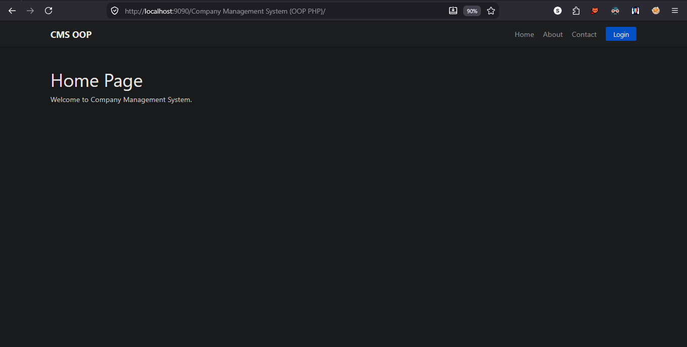

---

### 🔑 Authentication Page
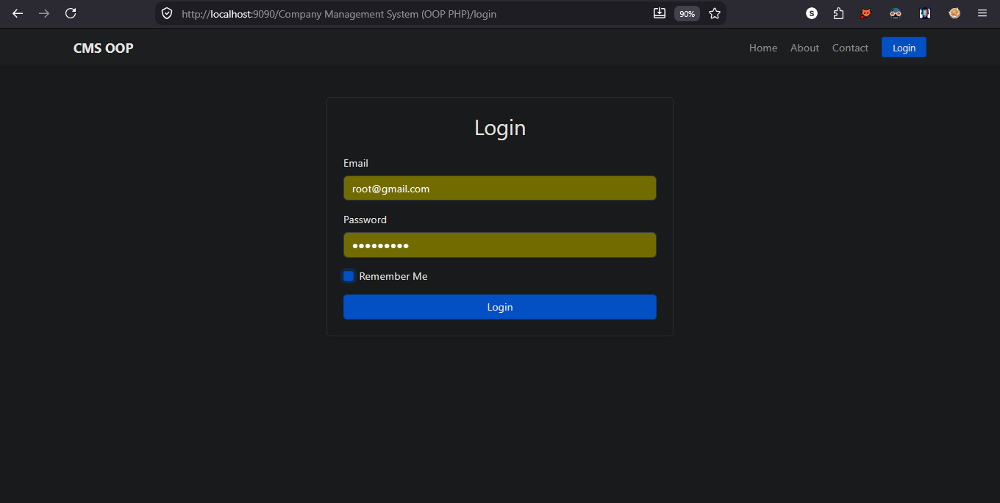

---

### 📉 System Analytics
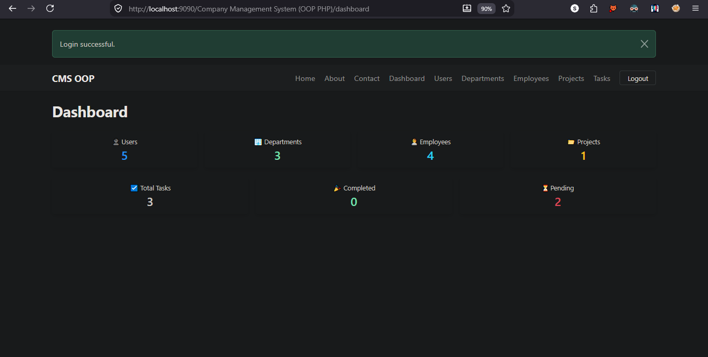

---

### 👥 User Directory
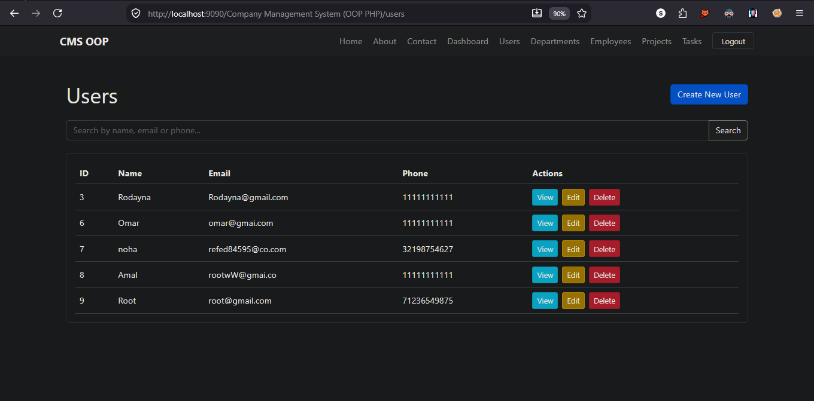

---

### 🏛️ Department Directory
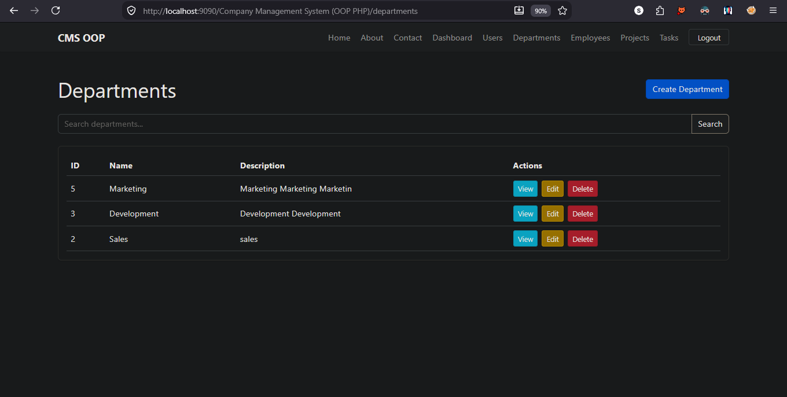

---

### 🔍 Department Details
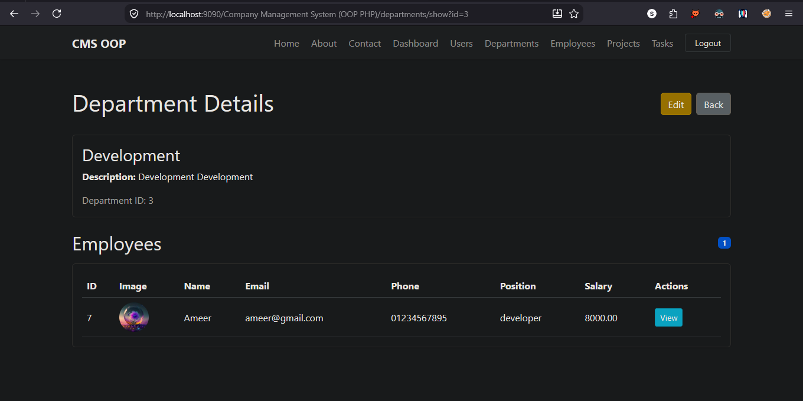

---

### 💼 Employee Roster
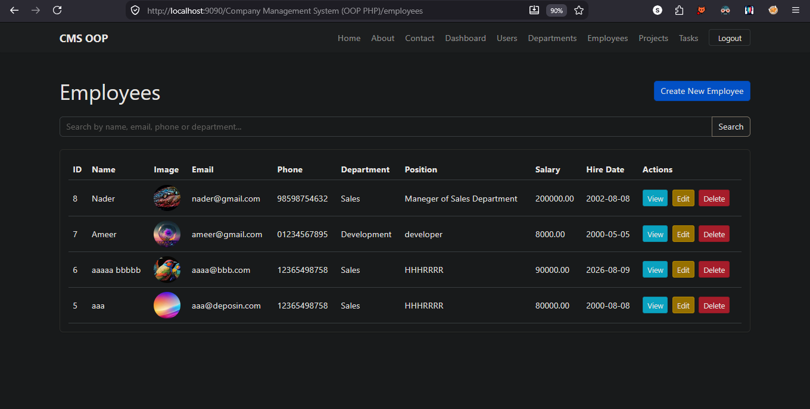

---

### ✏️ Modify Employee Details
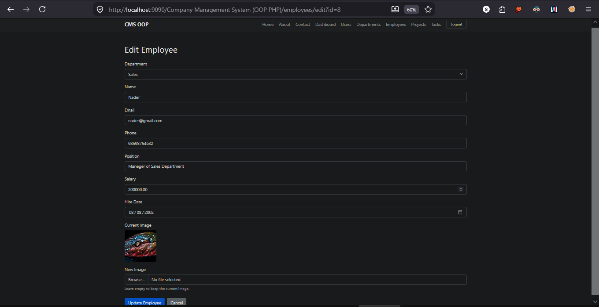

---

### 🔍 Employee Profile
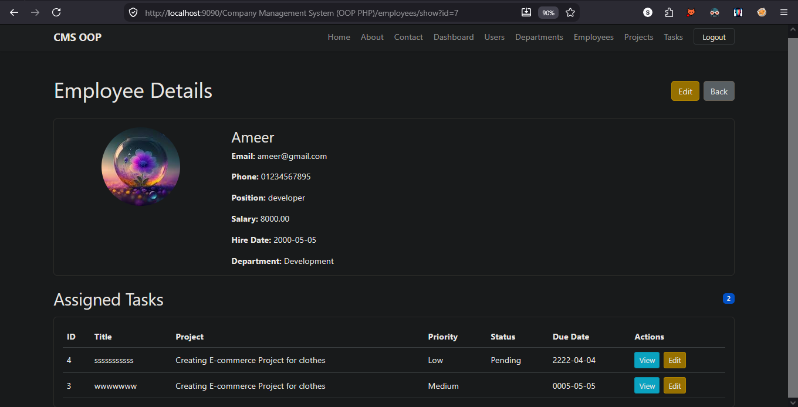

---

### 📋 Project Directory
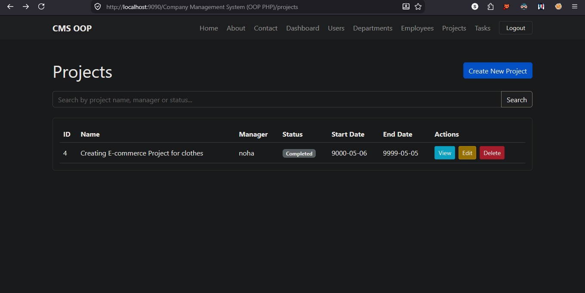

---

### 🔍 Project Details
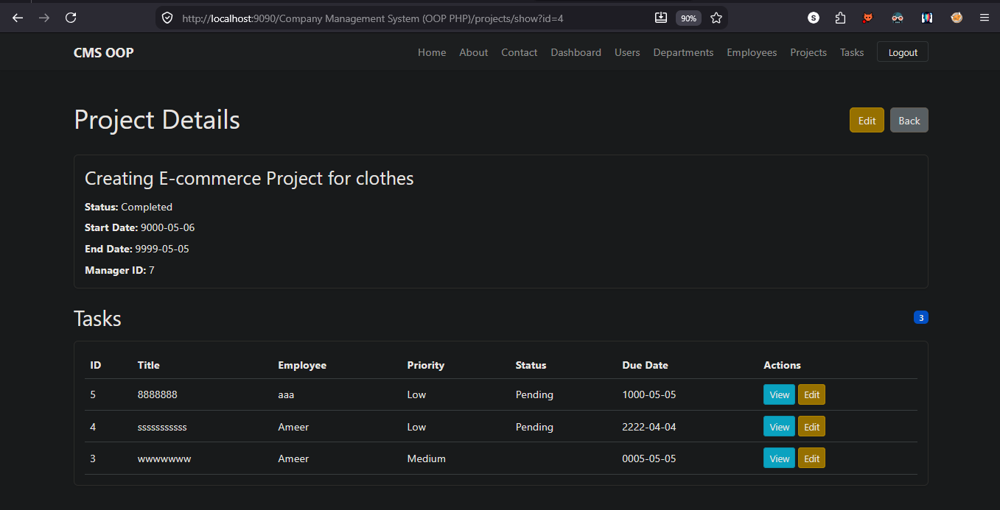

---

### 🎯 Task Management
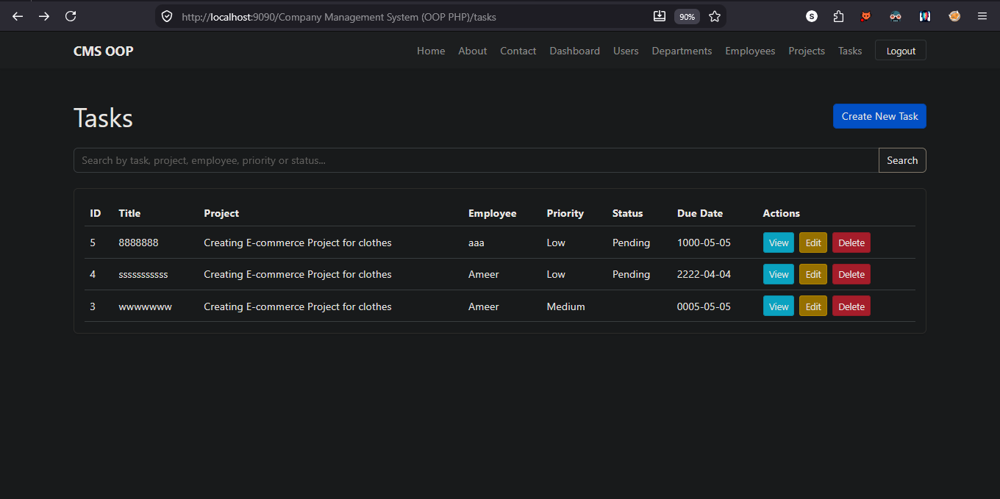

---


## 📈 Analytics & Metrics

The dashboard displays real-time statistics fetched directly from the database:

```text
Users          10
Departments     5
Employees      25
Projects        8
Tasks          42
Completed      20
Pending        22
```
---


## 🔗 Business Relationships

The system contains real business relationships between the modules.

### 🏢 Department → Employees

```text
Department
    ↓
Employees
```
### 🏢 Project → Tasks

```text
Project
    ↓
Tasks
```
### 🏢 Employee → Tasks

```text
Employee
    ↓
Assigned Tasks
```

### 🏢 User → Projects

```text
User
 ↓
Project Manager
 ↓
Projects
```

### 🏢 User → Projects

```text
                    Users
                      │
                      │ Manager
                      ↓
Department ─────── Employees
                      │
                      │ Assigned Tasks
                      ↓
                   Tasks
                      ↑
                      │
                   Project
                      │
                      └── Project Tasks
```
---


## 🔍 Search

Search functionality is available in all major modules.

| Module | Search By |
|---|---|
| Users | Name, Email |
| Departments | Department Name |
| Employees | Name, Email, Phone, Department |
| Projects | Project Name, Manager Name, Status |
| Tasks | Title, Project, Employee, Priority, Status |

All search operations use **Prepared Statements**.

---


## 🛡️ Security

The project applies several important security practices.

### 🔐 Password Hashing

```php
password_hash()
```

### 🔑 Password Verification

```php
password_verify()
```

### 🛡️ Prepared Statements

```php
$stmt = $this->db->prepare($sql);
$stmt->bind_param(...);
$stmt->execute();
```

### 🧹 Output Escaping

```php
htmlspecialchars($value)
```

### 🔒 Session Security

```php
session_regenerate_id(true);
```

### 🍪 Remember Token Security

Remember tokens are:

- Stored in a dedicated database table
- Associated with a specific user
- Given an expiration date
- Validated before automatic login
- Deleted during logout
- Removed from the browser cookie during logout

---


## 🏗️ Architecture

The project uses a custom **MVC-style architecture** built with Pure PHP and OOP.

### 🔄 Application Flow

```text
Request
   ↓
Router
   ↓
Controller
   ↓
Model
   ↓
Database
   ↓
View
```

### 🔄 Request Flow

```text
Browser
   ↓
public/index.php
   ↓
Router
   ↓
Controller
   ↓
Model
   ↓
MySQL
   ↓
Controller
   ↓
View
   ↓
Browser
```

## 🧩 Core Components

The project is organized into several core components that work together to provide a clean MVC-style architecture.

### 🚦 Router

The custom Router handles application routes.

```php
$router->get('/users', [$user, 'index']);

$router->post('/users/store', [$user, 'store']);
```

### 🎮 Controllers

Controllers handle application logic and connect Models with Views.

```text
AuthController
DashboardController
UserController
DepartmentController
EmployeeController
ProjectController
TaskController
```

### 🗄️ Models

Models are responsible for database operations.

```text
Model
UserModel
RememberTokenModel
DashboardModel
DepartmentModel
EmployeeModel
ProjectModel
TaskModel
```

### 🖥️ Views

Views are responsible for displaying application data.

```text
views/
├── auth/
├── dashboard/
├── users/
├── departments/
├── employees/
├── projects/
└── tasks/
```


## 📁 Project Structure

The project is organized into a clean MVC-style structure:

### 📂 Application

```text
app/
├── Config/
│   └── Database.php
│
├── Controllers/
│   ├── Controller.php
│   ├── AuthController.php
│   ├── DashboardController.php
│   ├── UserController.php
│   ├── DepartmentController.php
│   ├── EmployeeController.php
│   ├── ProjectController.php
│   └── TaskController.php
│
├── Core/
│   ├── Autoloader.php
│   └── Router.php
│
├── Helpers/
│   └── helpers.php
│
└── Models/
    ├── Model.php
    ├── UserModel.php
    ├── RememberTokenModel.php
    ├── DashboardModel.php
    ├── DepartmentModel.php
    ├── EmployeeModel.php
    ├── ProjectModel.php
    └── TaskModel.php
```

### 🗄️ Database

```text
database/
└── company_management_system.sql
```

### 🌐 Public Entry Point

```text
public/
└── index.php
```

### 🛣️ Routes

```text
routes/
└── web.php
```

### 🖥️ Views

```text
views/
├── auth/
├── dashboard/
├── users/
├── departments/
├── employees/
├── projects/
└── tasks/
```

### 📸 Screenshots

```text
screenshots/
├── dashboard.png
├── departments.png
├── edit_employees.png
├── employees.png
├── home.png
├── login.png
├── projects.png
├── tasks.png
├── users.png
├── view_department.png
├── view_employees.png
└── view_projects.png
```

### 📦 Project Root

```text
Company Management System
├── app/
├── database/
├── public/
├── routes/
├── views/
├── screenshots/
└── README.md
```

---

## 🗄️ Database

The complete MySQL database is included in:

```text
database/company_management_system.sql
```

Import this file into **MySQL/phpMyAdmin** before running the application.

---


## 🚀 Installation

The following steps will help you set up and run the project locally.

### The name of project should be : 
```bash
Company Management System (OOP PHP)
```

### The credentials to login :

### 🌐 Email : 
```bash
root@gmail.com
```

### 🌐 Password : 
```bash
123456789
```
### 📥 1. Clone the Repository

Clone the project from GitHub:

```bash
git clone https://github.com/Cooooooooooder/Company_Management_System_OOP_PHP.git
```

### 📂 2. Move the Project

Place the project inside your XAMPP `htdocs` directory:

```text
xampp/htdocs/
```

The name of project should be :

```text
htdocs/
└── Company Management System (OOP PHP)/
```

### 🗄️ 3. Create the Database

Create a MySQL database named:

```text
company_management_system
```

### 📥 4. Import the SQL File

Import the database file:

```text
database/company_management_system.sql
```

using **phpMyAdmin**.

### ⚙️ 5. Configure the Database Connection

Open:

```text
app/Config/Database.php
```

and configure your MySQL credentials.

Example:

```php
private const HOST = '127.0.0.1';
private const USERNAME = 'root';
private const PASSWORD = '';
private const DATABASE = 'company_management_system';
```

### ▶️ 6. Start XAMPP

Start the following services:

```text
Apache
MySQL
```

### 🌐 7. Open the Application

Open the project in your browser:

```text
http://localhost/Company%20Management%20System%20(OOP%20PHP)/
```

---

## 🎯 Project Goals

The project was created to demonstrate how to build a complete management system using **Pure PHP and OOP** without depending on a PHP framework.

### 💡 Main Learning Goals

- Object-Oriented Programming
- MVC-style Architecture
- CRUD Operations
- Database Relationships
- Authentication
- Remember Me Functionality
- Form Validation
- Prepared Statements
- Secure Password Handling
- Business Logic
- Search Functionality
- Dashboard Statistics

---

## 👨‍💻 Author

Developed by **Ahmed Ramadan**
Developed as a **Pure PHP / OOP Company Management System** project for learning and demonstrating real-world PHP application architecture.

GitHub:
https://github.com/cooooooooooder

---

## 📄 License

This project is intended for **educational and personal use**.

---

## ⭐ If you like this project

Give it a ⭐ on GitHub!

